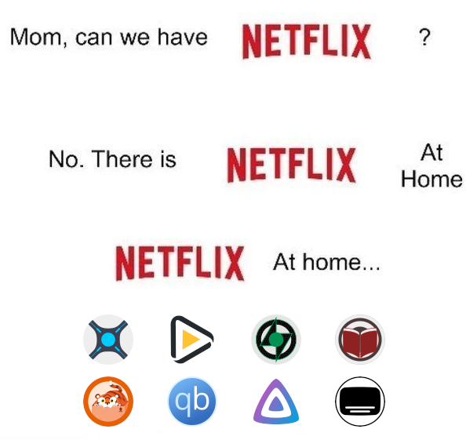

<p align="center" justify="center">
    
</p>

# netflix-at-home

A nearly fully preconfigured, Docker-based [*arr-stack](https://wiki.servarr.com/) and [Jellyfin](https://jellyfin.org/) setup for seamless streaming of movies, TV shows, music, and books.

## Usage
- Use **Jellyfin** to view media.
- Add new media using **Radarr (movies)**, **Sonarr (shows)**, **Lidarr (movies)**, or **Readarr (books)**. 

### Web Endpoints
- [Jellyfin (Media server)](http://localhost:8096/)

- [Bazarr (Subtitles)](http://localhost:6767/)
- [Radarr (Movies)](http://localhost:7878/)
- [Sonarr (Shows)](http://localhost:8989/)

- [Lidarr (Music)](http://localhost:8686/)

- [Readarr (Books)](http://localhost:8787/)

- [Prowlarr (Indexers)](http://localhost:9696/)
- [qBittorrent (Download client)](http://localhost:8080/)

### Default Credentials
- Username: `hey`
- Password: `lemmein`

**Note**: It is highly recommended to change the default credentials after the initial setup for security purposes.

## Prerequisites
- ### Docker
    - Must be ran with the WSL 2 backend if on Windows. Please refer to: [Docker WSL 2](https://docs.docker.com/desktop/features/wsl/).
    - Check `Enable host networking` under `Settings > Resources > Network`.

## Installation
1. Clone this repository:
    ```bash
    $ git clone https://github.com/your-repo/netflix-at-home.git
    $ cd netflix-at-home
    ```
2. Run the Docker containers:
    ```bash
    $ docker-compose up -d --remove-orphans
    ```
3. Download and install a [Jellyfin client](https://jellyfin.org/downloads/).
4. Add the media server running at `localhost:8096` to the client.
   
## Configuration

- ### Bazarr
    1. Create a free account at [OpenSubtitles.com](https://www.opensubtitles.com/).
    2. Navigate to [http://localhost:6767/settings/providers/](http://localhost:6767/settings/providers/).
    3. Add the provider `OpenSubtitles.com` and enter the credentials of your account.

- ### Jellyfin
    - (Optional) Configure serverside hardware acceleration under `Dashboard > Playback > Transcoding` thorugh a browser. This will allow all video formats to be viewed in the browser.
        - [Linux host with AMD GPU](https://jellyfin.org/docs/general/administration/hardware-acceleration/amd#configure-with-linux-virtualization/).
        - [Linux host with Nvidia GPU](https://jellyfin.org/docs/general/administration/hardware-acceleration/nvidia#configure-with-linux-virtualization/).
        - [Windows host with AMD GPU](https://jellyfin.org/docs/general/administration/hardware-acceleration/amd#configure-on-windows-host/).
        - [Windows host with Nvidia GPU](https://jellyfin.org/docs/general/administration/hardware-acceleration/nvidia/#configure-with-linux-virtualization/).
        - [Other](https://jellyfin.org/docs/general/administration/hardware-acceleration/)
